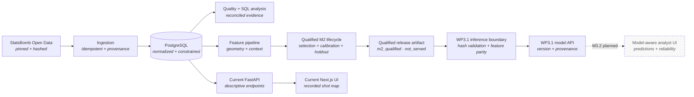

<div align="center">

# ⚽ Touchline Intelligence Platform

**An end-to-end football analytics and applied-ML platform built on open match data.**

From raw StatsBomb Open Data → a validated relational database → reproducible analysis and model
evidence → an analyst-facing product.

[**Live app**](https://touchline-intelligence.vercel.app) ·
[**API docs**](https://touchline-intelligence-production.up.railway.app/docs) ·
[**Model Card**](MODEL_CARD.md) ·
[**Data source & coverage**](DATA_SOURCE.md)

`Python 3.12` · `FastAPI` · `PostgreSQL` · `scikit-learn` · `PyTorch` · `Next.js 16` ·
`TypeScript` · `Docker`

</div>


---

## What this is

Touchline Intelligence turns a pinned StatsBomb Open Data snapshot into a defensible football-data
product: normalized PostgreSQL storage, reproducible ingestion and analysis, a deployed API and
analyst interface, and a fully evidenced shot-quality model lifecycle.

The project began with raw event data and a question: how do you build an analyst-facing system
whose numbers survive technical scrutiny? The answer was to build the data foundation before the
model, lock the evaluation design before final scoring, and commit the evidence behind each claim.

**M0, M1, and M2 are complete; M3 is in progress.** The repository contains a qualified
shot-conversion model, calibration and one-time tournament-holdout evidence, a reproducible release
packet, a canonical [Model Card](MODEL_CARD.md), and the WP3.1 versioned inference API.

> **Current product boundary:** WP3.1 model serving is implemented and Docker-verified in the
> repository but is not yet deployed. The live API and UI still show recorded, descriptive
> outcomes—not model predictions—and the UI remains the M0 descriptive view. Historical row-level
> model predictions are publication-gated off by default.

## Model at a glance

| Field | Current state |
|---|---|
| Task | Estimate the probability that an eligible recorded shot becomes a goal |
| Final base model | `full_minus_presence` L2-regularized logistic regression |
| Released variant | Base model plus the WC2022-fitted Platt transform adopted before holdout access |
| Features | 16 columns: two standardized geometry features and 14 categorical indicators |
| Development | WC2018 + Euro2020 — 2,872 shots in 115 matches |
| Calibration | WC2022 — 1,430 shots in 64 matches |
| Final holdout | Euro2024 — 1,304 shots in 51 matches |
| Lifecycle state | `m2_qualified` |
| Serving state | WP3.1 implemented in-repository; not yet deployed (`not_served` remains the M2 release record) |
| Canonical technical record | [MODEL_CARD.md](MODEL_CARD.md) |

The model estimates eligible non-penalty shot-conversion probability from engineered shot geometry
and recorded contextual categories. It is an independent Touchline Intelligence model—not
StatsBomb's proprietary xG—and provider xG is deliberately removed before storage and never used as
a feature.

The [Model Card](MODEL_CARD.md) owns the model-specific detail: exact identity and feature contract,
the candidate journey, calibration and holdout protocol, metrics and uncertainty, limitations,
reproducibility scope, and version/provenance chain. This README is the project overview, not a
second model record.

## What has been built

| Capability | What exists now |
|---|---|
| **Data foundation** | A pinned and hashed 465-file source snapshot, normalized PostgreSQL schema, ordered hand-written migrations, and idempotent ingestion that rejects changed source facts instead of silently rewriting them |
| **Quality and analysis** | Read-only reconciliation, schema/data-quality contracts, deterministic fixtures, reproducible clean rebuild evidence, and ten documented SQL analyses with measured query plans |
| **Deployed product** | A FastAPI backend and Next.js analyst interface serving the World Cup 2022 descriptive baseline and recorded shot map, with liveness/readiness checks and explicit data-provider boundaries |
| **Feature pipeline** | Numerically stable distance-to-goal and visible-angle geometry plus documented categorical coverage, training-only preprocessing, and a fixed 16-column feature contract |
| **Leak-resistant evaluation** | Locked tournament roles, five deterministic match-grouped development folds, and explicit separation of model selection, calibration, and final holdout permissions |
| **Controlled model selection** | Constant and geometry references, richer regularized-logistic candidates, a registered HistGradientBoosting challenge, and a bounded deterministic PyTorch MLP qualification |
| **Calibration and final evaluation** | A pre-holdout WC2022 Platt decision followed by one supervised Euro2024 tournament-holdout evaluation with reliability, supported slices, and match-clustered paired uncertainty |
| **Reproducible release** | A content-hashed M2 release packet whose historical development-only training artifact was reproduced byte-identically under the exact registered environment |
| **Executable contracts** | Unit, integration, provenance, artifact-integrity, and mutation checks that deliberately break protected behavior to prove the tests detect it |
| **Canonical model documentation** | A final [Model Card](MODEL_CARD.md) connecting the released estimator, evidence, limitations, and serving boundary |

## Model-development journey

Complexity was challenged rather than assumed to be better. Every candidate used the same locked
development rows and match-grouped folds:

1. a training-fold-rate constant reference;
2. geometry-only regularized logistic regression;
3. richer logistic candidates;
4. a controlled `HistGradientBoostingClassifier` grid;
5. a bounded `16 → 8 → 1` PyTorch MLP.

The two provider presence annotations tested in the richest logistic candidate failed their
registered consistency gate, producing the 16-column `full_minus_presence` feature set. The
gradient booster and MLP were valid controlled challengers—not failed engineering work—but neither
met all registered replacement conditions. The simpler regularized logistic model therefore
remained the evidence-backed base estimator.

### Evaluation design

| Role | Tournament(s) | What it was allowed to do |
|---|---|---|
| Development and model selection | WC2018 + Euro2020 | Select features, preprocessing, regularization, and the base estimator using five match-grouped folds |
| Calibration only | WC2022 | Fit one Platt transform to frozen base logits and apply the predeclared adoption rule |
| Final tournament holdout | Euro2024 | Evaluate the already-frozen raw and pre-adopted calibrated variants once |

From WP2.3 onward, this separation prohibited Euro2024 outcomes from influencing feature, model, or
calibration choices. The holdout was locked, not historically blind: published cohort counts and
earlier untracked exploration had already exposed some aggregate outcomes before the protocol was
frozen. Euro2024 was not used to choose a different model after the final result was known; it
remains a transport evaluation, not a tuning set. Because time and competition composition change
together, it is described as a **tournament holdout**, not a pure temporal-drift test.

### Calibration and holdout result

The WC2022 rule adopted the calibrated variant before Euro2024 was opened. On the Euro2024 holdout,
the transform slightly worsened the two probability-quality scores while leaving ranking metrics
unchanged:

| Euro2024 variant | Log loss ↓ | Brier ↓ | ROC AUC ↑ |
|---|---:|---:|---:|
| Raw base model | 0.239308 | 0.064707 | 0.744678 |
| Pre-holdout-adopted calibrated model | 0.243113 | 0.066030 | 0.744678 |

The project did not reverse the calibration decision after seeing Euro2024: doing so would turn the
holdout into another selection set. That less-flattering result is retained because the evaluation
discipline matters more than presenting the best retrospective number. Exact values, bootstrap
intervals, reliability tables, and interpretation boundaries are in the
[Model Card](MODEL_CARD.md#final-euro2024-tournament-holdout).

### Reproducibility is part of the result

WP2.8 reproduced the historical development training run inside the exact registered Windows
AMD64, CPython 3.12.11, uv 0.11.25, lockfile, commit, and configuration boundary. Within that
environment, the regenerated model artifact was byte-identical, canonical metrics JSON was equal,
and the feature contract matched.

The reproduction loaded only the 2,872 development shots. It did not reopen, preprocess, or score
WC2022 calibration rows or Euro2024 holdout rows. The byte-identical claim is deliberately scoped
to the registered environment; it is not a claim about arbitrary operating systems or dependency
resolutions. See the [WP2.8 closeout](reports/wp2.8-reproducible-release-closeout.md) and
[Model Card](MODEL_CARD.md#reproducibility-and-release-status) for the content-hash and provenance
chain.

## Architecture

Solid arrows are implemented in the repository. Dashed arrows show the model-aware UI work that
remains; the WP3.1 inference/API path is Docker-verified but not yet deployed.



| Layer | Choice | Why |
|---|---|---|
| Data | StatsBomb Open Data, pinned to a commit SHA | Open event data is reproducible only when its live repository revision is fixed |
| Storage | PostgreSQL + ordered SQL migrations | Explicit grains, relationships, constraints, and query plans without an ORM hiding the schema |
| Modeling | scikit-learn + bounded PyTorch | Controlled classical and neural candidates under one locked protocol |
| Backend | Python 3.12, FastAPI, psycopg | Typed settings, strict mypy, and a small serving surface |
| Frontend | Next.js 16, React 19, TypeScript | Server-rendered analyst views with end-to-end type safety |
| Infrastructure | Docker Compose locally · Vercel + Railway + Neon in production | A small, reproducible stack deployable by one person |
| Quality | Ruff, mypy, pytest, Vitest, GitHub Actions | One `uv run poe check` covers the Python checks used by CI |

## The data

Four international tournaments are ingested in full:

| Tournament | Matches | Events | Shots |
|---|---:|---:|---:|
| FIFA World Cup 2018 | 64 | 227,825 | 1,706 |
| UEFA Euro 2020 | 51 | 192,664 | 1,289 |
| FIFA World Cup 2022 | 64 | 234,637 | 1,494 |
| UEFA Euro 2024 | 51 | 187,924 | 1,340 |
| **Total** | **230** | **843,050** | **5,829** |

The snapshot also contains 54 teams, 1,989 players, 11,062 lineup memberships, 39,262
possessions, 1.23M directed event relations, and 78,866 actors from shot-embedded freeze frames.
The fixed model cohort contains 5,606 eligible non-penalty shots and 507 goals.

The **public API is intentionally limited to World Cup 2022** while an open question about
row-level data redistribution is resolved with the provider—see
[`DATA_SOURCE.md`](DATA_SOURCE.md). The internal model evidence spans all four tournaments; that
does not expand the public row-level serving scope.

Two important boundaries:

- **Provider xG is never ingested.** It is removed before typed storage and blocked by a database
  constraint, so it cannot leak into this model.
- **Shot freeze frames are not called tracking data.** They are partial snapshots around individual
  events, not continuous player tracking or StatsBomb 360 data.

## What is live—and what comes next

Live today:

- the World Cup 2022 descriptive conversion summary and recorded shot map;
- paginated read-only shot data plus health and readiness endpoints;
- the Vercel → Railway → Neon deployed path.

Implemented in the repository but not live yet:

- fail-fast loading of the minimal qualified serving bundle;
- versioned model metadata, curated metrics, and validated calibrated prediction endpoints;
- independent WP2-to-WP3 golden feature/parity evidence;
- WC2022 historical calibrated predictions, publication-gated off by default.

The live UI remains descriptive and exposes no model probability. M3.2–M3.4 still own the
model-aware analyst view, deployment hardening, deployed smoke tests, and rebuild/rollback evidence.

## Roadmap

| Milestone | Ships | State |
|---|---|---|
| **M0** Walking skeleton | Data → PostgreSQL → descriptive API → recorded-shot UI → deployment | ✅ Complete |
| **M1** Data foundation | Relational schema, idempotent ingestion, quality audit, SQL pack, and reproducible clean rebuild | ✅ Complete |
| **M2** Shot quality engine | Fixed cohort and features; locked splits; logistic selection; boosting and PyTorch challengers; calibration; one-time Euro2024 holdout; reproducible release; canonical Model Card | ✅ Complete |
| **M3** Analyst interface and serving | WP3.1 versioned serving and feature parity implemented; model-aware UI, deployment hardening, smoke tests, and rollback documentation remain | **In progress** |
| **M4** Release and communication | Technical write-up, stakeholder summary, demo video and screenshots, attribution audit, and application materials | Planned |

The detailed work-package sequence remains in [`docs/PLAN.md`](docs/PLAN.md); the milestone states
above reflect the merged repository at M2 closeout.

## Quick start

You need [uv](https://docs.astral.sh/uv/), Node.js 24, and Docker Desktop.

```bash
git clone https://github.com/utkuvibing/touchline-intelligence.git
cd touchline-intelligence

cp .env.example .env
uv sync
npm --prefix frontend ci

docker compose -f infra/docker-compose.yml up -d

uv run poe migrate
uv run poe ingest
```

`ingest` downloads the pinned 465-file StatsBomb snapshot on first run; identical reruns are
no-ops.

```bash
uv run poe api
```

The API is then available at `http://localhost:8000` (docs at `/docs`), and
`npm --prefix frontend run dev` serves the interface at `http://localhost:3000`.

`uv run poe check` runs the Python format check, lint, strict type check, and test suite used by CI.
`uv run poe quality` re-audits an ingested database against the source and writes a report under
`reports/`.

Database-mutating integration tests build isolated schemas and refuse any non-local target before
a connection is opened. Read-only full-cohort evidence tests require a separate explicit database
variable and use read-only transactions.

## Repository layout

```text
backend/src/touchline/   FastAPI, ingestion, quality, features, modeling, release tooling
backend/sql/             Hand-written analytical and verification queries
backend/tests/           Unit, integration, model-contract, artifact, and reproducibility tests
frontend/                Next.js analyst interface, TypeScript, and Vitest
infra/                   Docker Compose for local PostgreSQL
data/provenance/         Source revision and per-file hash manifests
data/model/              Locked model split artifacts
experiments/             Registered configs, immutable metrics, artifacts, and release packets
reports/                 Measured data and modeling evidence
docs/modeling/           Modeling contracts and protocol boundaries
scripts/                 Developer, smoke-test, and mutation-verification entry points
MODEL_CARD.md             Canonical M2 model-specific technical record
```

## Engineering principles

- **No unevaluated number is presented as a result.** The live API's conversion rate identifies
  itself as a description of loaded data, not a prediction.
- **The live shot map encodes recorded outcomes only.** Uniform marker size and no probability
  colour scale prevent it from being mistaken for model output.
- **Evaluation permissions are explicit.** Development selects the model, WC2022 calibrates it, and
  Euro2024 evaluates the frozen decision once.
- **Complexity must earn replacement.** More elaborate models remain challengers unless they pass
  the registered evidence rules.
- **Tests protect named contracts, not a coverage percentage.** A mutation harness deliberately
  breaks protected behavior and verifies that tests detect it.
- **Measured evidence is committed and content-hashed.** Reports summarize it; immutable JSON and
  manifests own exact machine values.
- **Qualification is not deployment.** The qualified model is not described as served until M3
  proves the inference and product boundary.

## Credits and attribution

### Data provided by StatsBomb

<a href="https://github.com/statsbomb/open-data"><b>StatsBomb Open Data</b></a> makes this project
possible.

StatsBomb (now part of [Hudl](https://www.hudl.com/)) publishes detailed event-level data for major
competitions, including complete World Cup and European Championship coverage.

- Repository: <https://github.com/statsbomb/open-data>
- Pinned revision: `b0bc9f22dd77c206ddedc1d742893b3bbe64baec` (2026-05-26)
- Terms and README reviewed on **2026-08-01**—see [`DATA_SOURCE.md`](DATA_SOURCE.md)

**Please respect the source terms.** StatsBomb Open Data is governed by its own Public Data User
Agreement and requires attribution. If you build on this repository, credit StatsBomb, review the
agreement yourself, and do not redistribute the data.

Two publication questions remain explicitly open: the official Media Pack did not expose a clearly
approved downloadable logo asset, and the agreement did not clearly resolve whether a public
row-level API is permitted analysis or prohibited redistribution. Public row-level coverage stays
limited to World Cup 2022 until StatsBomb/Hudl clarifies them.

This project **does not reproduce StatsBomb's proprietary xG model**. The data provider supplies the
event data; Touchline's shot-quality model is an independent estimate built without provider xG.

### Built with

[FastAPI](https://fastapi.tiangolo.com/) · [PostgreSQL](https://www.postgresql.org/) ·
[scikit-learn](https://scikit-learn.org/) · [PyTorch](https://pytorch.org/) ·
[Next.js](https://nextjs.org/) · [uv](https://docs.astral.sh/uv/) ·
[Ruff](https://docs.astral.sh/ruff/) · [pytest](https://pytest.org/) ·
[Vitest](https://vitest.dev/)—hosted on [Vercel](https://vercel.com/),
[Railway](https://railway.com/), and [Neon](https://neon.com/).

### Author

Built by **Utku Şahin** as an end-to-end portfolio project in football analytics and applied
machine learning. Questions, corrections, and pointed criticism are welcome—open an issue or get
in touch:

[](https://www.linkedin.com/in/utku-%C5%9Fahin-696397210/)

## Licence

**Source-available, not open source.** The code is public so it can be read and evaluated; it is not
licensed for reuse. See [`LICENSE`](LICENSE) for what that permits—and ask if you want to use a
piece of it.

The match data belongs to StatsBomb/Hudl and is governed by its own agreement. Nothing in this
repository grants rights to it.
