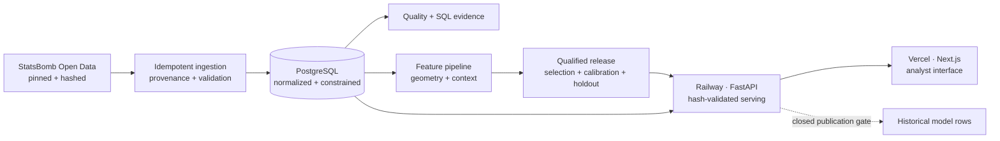

<div align="center">

# ⚽ Touchline Intelligence

**A production-deployed football analytics and applied-ML portfolio.**

Pinned StatsBomb event data → validated PostgreSQL → reproducible shot-quality model → model-evidence interface.

[](https://github.com/utkuvibing/touchline-intelligence/actions/workflows/ci.yml)


[**Open the live analyst app**](https://touchline-intelligence.vercel.app) ·
[**Explore the API**](https://touchline-intelligence-production.up.railway.app/docs) ·
[**Read the Model Card**](MODEL_CARD.md) ·
[**Inspect the evidence**](reports/wp3.4-deployed-smoke-and-recovery-evidence.md)

`Python 3.12` · `FastAPI` · `PostgreSQL` · `scikit-learn` · `PyTorch` ·
`Next.js 16` · `TypeScript` · `Docker`

</div>

---


## At a glance

| Live product | Selected model | Evaluation | Public boundary |
|---|---|---|---|
| **Vercel interface + Railway API**<br>deployed; 22/22 production smoke checks passed | **L2-regularized logistic regression**<br>geometry + recorded shot context | **Euro 2024 tournament holdout**<br>raw and calibrated variants reported | **Historical rows unavailable**<br>pending data-use clarification |

Touchline Intelligence turns a pinned open-data snapshot into a defensible end-to-end system. The
project emphasizes the parts that are easiest to hand-wave and hardest to defend in an interview:
data lineage, leakage control, evaluation permissions, calibrated probabilities, reproducible
artifacts, deployment contracts, and recovery evidence.

On the locked development folds, the selected logistic model reduced mean log loss from `0.302`
for the training-fold constant reference to `0.263`. More complex boosting and neural challengers
did not earn replacement. The final Euro 2024 result—including the calibrated variant's worse
proper scores—is reported below rather than hidden.

## What it demonstrates

| Area | Implemented evidence |
|---|---|
| **Data engineering** | 465 pinned and hashed source files, normalized PostgreSQL, ordered migrations, idempotent ingestion, reconciliation, and clean rebuilds |
| **Applied ML** | Fixed cohort, deterministic tournament splits, engineered geometry, controlled model comparison, calibration, and one-time holdout evaluation |
| **Release engineering** | Content-hashed serving bundle, provenance checks, golden parity, strict API contracts, and tests that deliberately exercise critical failure guards |
| **Product delivery** | Model-aware Next.js analyst interface, FastAPI serving layer, readiness, CORS, request IDs, and attribution |
| **Operations** | Production smoke, isolated-database rebuild, Railway rollback/roll-forward, and Vercel rollback/promote rehearsals |
| **Responsible boundaries** | No provider xG ingestion, no tracking-data claims, explicit uncertainty, and a closed historical publication gate |

## Architecture



| Layer | Choice | Reason |
|---|---|---|
| Data | StatsBomb Open Data pinned to a commit | A live repository is reproducible only when its revision is fixed |
| Storage | PostgreSQL + ordered SQL migrations | Explicit grains, relationships, constraints, and query plans |
| Modeling | scikit-learn + bounded PyTorch | Classical and neural candidates under one locked protocol |
| Delivery | FastAPI + Next.js | A small typed serving surface and analyst-facing product |
| Infrastructure | Neon + Railway + Vercel | Rebuildable production dependencies with rehearsed recovery |

## Model evidence

The released model estimates the probability that an eligible recorded shot becomes a goal. It is
an independent Touchline Intelligence model—not StatsBomb's proprietary xG—and provider xG is
removed before storage.

| Role | Tournament(s) | Matches | Shots | Permission |
|---|---|---:|---:|---|
| Development | WC 2018 + Euro 2020 | 115 | 2,872 | Features, preprocessing, and model selection |
| Calibration | WC 2022 | 64 | 1,430 | Fit and pre-adopt one Platt transform |
| Final holdout | Euro 2024 | 51 | 1,304 | Evaluate the frozen decision once |

| Euro 2024 result | Raw model | Released calibrated model |
|---|---:|---:|
| Log loss ↓ | 0.239308 | 0.243113 |
| Brier ↓ | 0.064707 | 0.066030 |
| ROC AUC ↑ | 0.744678 | 0.744678 |

Calibration was adopted on WC 2022 before the Euro 2024 holdout was opened. The project did not
reverse that decision after the calibrated variant performed slightly worse on the holdout; doing
so would turn the final evaluation into another selection set. The [Model Card](MODEL_CARD.md) owns
the complete metrics, uncertainty, limitations, feature contract, and provenance chain.

<details>
<summary><strong>Why the simpler model won</strong></summary>

Constant and geometry references, richer regularized-logistic candidates, a registered gradient
boosting grid, and a bounded `16 → 8 → 1` PyTorch MLP were compared on the same locked development
rows and folds. The two more complex challengers were valid experiments, but neither met every
pre-registered replacement condition. The `full_minus_presence` L2-regularized logistic model
therefore remained the evidence-backed base estimator.

</details>

## Data scope

| Tournament | Matches | Events | Shots |
|---|---:|---:|---:|
| FIFA World Cup 2018 | 64 | 227,825 | 1,706 |
| UEFA Euro 2020 | 51 | 192,664 | 1,289 |
| FIFA World Cup 2022 | 64 | 234,637 | 1,494 |
| UEFA Euro 2024 | 51 | 187,924 | 1,340 |
| **Total** | **230** | **843,050** | **5,829** |

The fixed model cohort contains 5,606 eligible non-penalty shots and 507 goals. Shot freeze frames
are treated as event snapshots, not continuous tracking data.

> **Publication boundary:** the public descriptive API remains limited to World Cup 2022. Current
> written terms do not clearly resolve public row-level historical probability publication, so
> `/model/shots` fails closed. See [DATA_SOURCE.md](DATA_SOURCE.md).

## Production status

- **Frontend:** [touchline-intelligence.vercel.app](https://touchline-intelligence.vercel.app)
- **Backend:** [touchline-intelligence-production.up.railway.app](https://touchline-intelligence-production.up.railway.app)
- **Serving release:** `exp-20260810-wp2_8-release`
- **Acceptance:** 22/22 deployed smoke checks passed
- **Recovery:** isolated fresh-Neon rebuild and Railway/Vercel recovery rehearsals passed
- **Historical publication:** not cleared; `/model/shots` remains closed

The exact deployment identities, rebuild counts, recovery sequence, and closeout evidence
are recorded in the [WP3.4 evidence report](reports/wp3.4-deployed-smoke-and-recovery-evidence.md).

## Roadmap

```text
M0 Walking skeleton   ✅
M1 Data foundation    ✅
M2 Model lifecycle    ✅
M3 Serving + product  ✅
M4 Communication      ← NEXT
```

**Current milestone: M4 — Release and Communication.** It packages the completed technical work
into a write-up, stakeholder summary, demo video, screenshots, attribution audit, and application
materials.

## Run locally

For a first look, use the [live analyst app](https://touchline-intelligence.vercel.app) and
[model API](https://touchline-intelligence-production.up.railway.app/model). A local run rebuilds
the PostgreSQL schema and downloads the pinned 465-file StatsBomb snapshot, so it is the
reproducibility path rather than the fastest product tour.

You need [uv](https://docs.astral.sh/uv/), Node.js 24, and Docker Desktop. On Windows PowerShell,
use `Copy-Item .env.example .env` in place of `cp .env.example .env`.

```bash
git clone https://github.com/utkuvibing/touchline-intelligence.git
cd touchline-intelligence
cp .env.example .env

uv sync --no-default-groups --group dev
npm --prefix frontend ci
docker compose -f infra/docker-compose.yml up -d

uv run --no-sync poe migrate
uv run --no-sync poe ingest
uv run --no-sync poe api
```

The API runs at `http://localhost:8000` and `npm --prefix frontend run dev` starts the interface at
`http://localhost:3000`.

The lean install above excludes the optional PyTorch modeling environment. To reproduce model
experiments or run the complete Python validation used by CI, install the locked default groups:

```bash
uv sync
uv run poe check
```

<details>
<summary><strong>Repository map</strong></summary>

```text
backend/src/touchline/   API, ingestion, quality, features, modeling, release tooling
backend/sql/             Hand-written analysis and verification queries
backend/tests/           Unit, integration, artifact, and contract tests
frontend/                Next.js analyst interface and Vitest suite
infra/                   Local PostgreSQL via Docker Compose
data/provenance/         Source revision and per-file hashes
experiments/             Registered configs, metrics, artifacts, and release packets
reports/                 Measured evidence and closeouts
docs/modeling/           Modeling contracts and protocol boundaries
scripts/                 Developer, smoke, and mutation-verification entry points
```

</details>

Useful code entry points:

- [`backend/src/touchline/main.py`](backend/src/touchline/main.py) — API and operational endpoints;
- [`backend/src/touchline/modeling/train.py`](backend/src/touchline/modeling/train.py) — locked
  logistic experiment pipeline; and
- [`frontend/components/AnalystView.tsx`](frontend/components/AnalystView.tsx) — deployed model
  evidence interface.

## Evidence map

| Question | Canonical record |
|---|---|
| What exactly is the released model? | [MODEL_CARD.md](MODEL_CARD.md) |
| Which data is used and what may be published? | [DATA_SOURCE.md](DATA_SOURCE.md) |
| How was the reproducible release qualified? | [WP2.8 closeout](reports/wp2.8-reproducible-release-closeout.md) |
| What passed in production and recovery? | [WP3.4 closeout](reports/wp3.4-deployed-smoke-and-recovery-evidence.md) |

## Credits and licence

### Data provided by StatsBomb

<a href="https://github.com/statsbomb/open-data"></a>

[StatsBomb Open Data](https://github.com/statsbomb/open-data) supplies the event data. The snapshot
is pinned to `b0bc9f22dd77c206ddedc1d742893b3bbe64baec`; terms and coverage were reviewed on 2026-08-01.
StatsBomb is now part of [Hudl](https://www.hudl.com/).

This project does **not** reproduce StatsBomb's proprietary xG model. Please preserve attribution,
review the provider agreement, and do not redistribute the source data.

Built by **Utku Şahin** as an end-to-end portfolio project in football analytics and applied ML.

[](https://www.linkedin.com/in/utku-%C5%9Eahin-696397210/)

**Source-available, not open source.** See [LICENSE](LICENSE). The match data remains governed by
StatsBomb/Hudl's own agreement.
