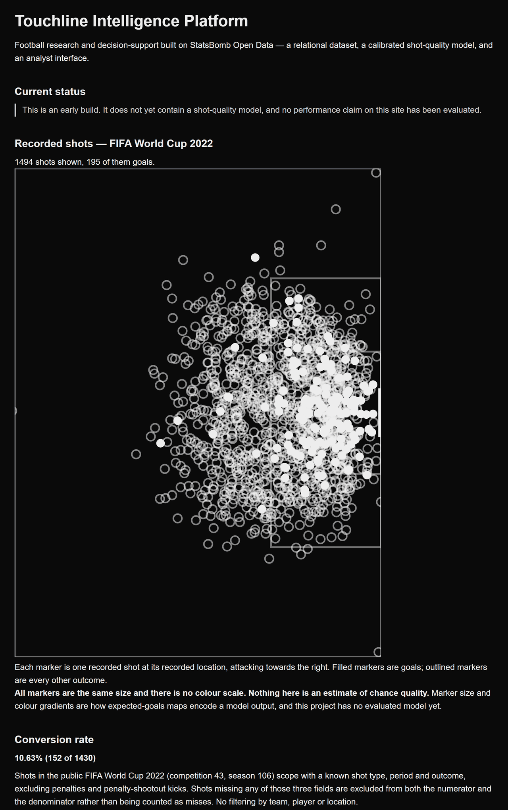
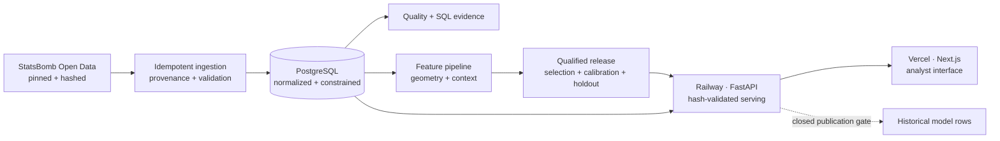

<div align="center">

# Touchline Intelligence

Shot-quality modeling from pinned StatsBomb event data, deployed end to end.

Pinned StatsBomb event data → validated PostgreSQL → reproducible shot-quality model → model-evidence interface.

[](https://github.com/utkuvibing/touchline-intelligence/actions/workflows/ci.yml)


[**Open the live analyst app**](https://touchline-intelligence.vercel.app) ·
[**Explore the API**](https://touchline-intelligence-production.up.railway.app/docs) ·
[**Read the Model Card**](MODEL_CARD.md) ·
[**Inspect the evidence**](reports/wp3.4-deployed-smoke-and-recovery-evidence.md)

`Python 3.12` · `FastAPI` · `PostgreSQL` · `scikit-learn` · `PyTorch` ·
`Next.js 16` · `TypeScript` · `Docker`

</div>

---



## At a glance

The live product runs on Vercel and Railway and passed 22 of 22 production smoke checks. The
released model is L2-regularized logistic regression over shot geometry and recorded shot context.
Euro 2024 was opened once as the final holdout, and both the raw and calibrated variants are
reported below. Historical row predictions stay unavailable until the provider clarifies data-use
terms in writing.

I designed this project around the parts of applied ML that are easiest to hand-wave and hardest
to defend when someone asks how you know: data lineage, leakage control, evaluation permissions,
calibrated probabilities, and recovery evidence. Every claim on this page points at a measured
record in `reports/`.

On the locked development folds, the selected logistic model brought mean log loss down from
`0.302` (training-fold constant reference) to `0.263`. Gradient boosting and a small PyTorch
network got a fair run under the same protocol and did not beat it. On Euro 2024 the calibrated
variant scored worse than the raw one. That negative result is part of the record; hiding it would
defeat the point of the project.

## What it demonstrates

| Area | Evidence |
|---|---|
| Data engineering | 465 pinned, hashed source files load into normalized PostgreSQL through ordered migrations. Ingestion is idempotent and rebuilds come out clean. |
| Applied ML | Fixed cohort, deterministic tournament splits, engineered geometry, controlled model comparison, calibration, one-time holdout |
| Release engineering | Content-hashed serving bundle, provenance checks, golden parity, strict API contracts, tests that hit the failure guards on purpose |
| Product delivery | Model-aware Next.js analyst interface, FastAPI serving layer, readiness and CORS handling, request IDs, attribution |
| Operations | Production smoke checks, isolated-database rebuild, Railway rollback and roll-forward, Vercel rollback and promote rehearsals |
| Responsible boundaries | No provider xG ingested, no tracking-data claims, explicit uncertainty, closed historical publication gate |

## Architecture



| Layer | Choice | Reason |
|---|---|---|
| Data | StatsBomb Open Data pinned to a commit | A live repository is only reproducible if its revision is fixed |
| Storage | PostgreSQL + ordered SQL migrations | Explicit grains, relationships, constraints, and query plans |
| Modeling | scikit-learn + bounded PyTorch | Classical and neural candidates under one locked protocol |
| Delivery | FastAPI + Next.js | Small typed API, analyst-facing frontend |
| Infrastructure | Neon + Railway + Vercel | Each dependency was rebuilt or rolled back at least once during rehearsals |

## Model evidence

The released model estimates the probability that an eligible recorded shot becomes a goal. It is
an independent Touchline Intelligence model, not StatsBomb's proprietary xG. The ingest pipeline
strips provider xG before anything reaches storage.

| Role | Tournament(s) | Matches | Shots | Permission |
|---|---|---:|---:|---|
| Development | WC 2018 + Euro 2020 | 115 | 2,872 | Features, preprocessing, and model selection |
| Calibration | WC 2022 | 64 | 1,430 | Fit and pre-adopt one Platt transform |
| Final holdout | Euro 2024 | 51 | 1,304 | Evaluate the frozen decision once |

| Euro 2024 result | Raw model | Released calibrated model |
|---|---:|---:|
| Log loss ↓ | 0.239308 | 0.243113 |
| Brier ↓ | 0.064707 | 0.066030 |
| ROC AUC ↑ | 0.744678 | 0.744678 |

We fit the Platt transform on WC 2022 and adopted it before Euro 2024 was ever opened. The
calibrated variant then came out slightly worse on both proper scores. Reversing the decision at
that point would have turned the holdout into another selection set, so the shipped release keeps
calibration and reports both variants. The [Model Card](MODEL_CARD.md) has the full metrics,
uncertainty, limitations, feature contract, and provenance chain.

<details>
<summary><strong>Why the simpler model won</strong></summary>

Every candidate trained on the same locked development rows and folds: constant and geometry
baselines, several regularized logistic variants, a registered gradient boosting grid, and a
bounded `16 → 8 → 1` PyTorch MLP. Boosting and the MLP were real experiments, but each missed at
least one pre-registered replacement condition. The `full_minus_presence` L2-regularized logistic
model stayed.

</details>

## Data scope

| Tournament | Matches | Events | Shots |
|---|---:|---:|---:|
| FIFA World Cup 2018 | 64 | 227,825 | 1,706 |
| UEFA Euro 2020 | 51 | 192,664 | 1,289 |
| FIFA World Cup 2022 | 64 | 234,637 | 1,494 |
| UEFA Euro 2024 | 51 | 187,924 | 1,340 |
| **Total** | **230** | **843,050** | **5,829** |

The fixed model cohort contains 5,606 eligible non-penalty shots and 507 goals. Shot freeze frames
are event snapshots, not continuous tracking data.

> Publication boundary: the public descriptive API covers World Cup 2022 only. Current written
> terms do not clearly resolve public row-level publication of historical probabilities, so
> `/model/shots` fails closed. See [DATA_SOURCE.md](DATA_SOURCE.md).

## Production status

- Frontend: [touchline-intelligence.vercel.app](https://touchline-intelligence.vercel.app)
- Backend: [touchline-intelligence-production.up.railway.app](https://touchline-intelligence-production.up.railway.app)
- Serving release: `exp-20260810-wp2_8-release`
- Acceptance: 22/22 deployed smoke checks passed
- Recovery: fresh isolated Neon rebuild plus Railway and Vercel recovery rehearsals passed
- Historical publication: not cleared; `/model/shots` stays closed

Deployment identities, rebuild counts, and the recovery sequence live in the
[WP3.4 evidence report](reports/wp3.4-deployed-smoke-and-recovery-evidence.md).

## Roadmap

```text
M0 Walking skeleton   ✅
M1 Data foundation    ✅
M2 Model lifecycle    ✅
M3 Serving + product  ✅
M4 Communication      ✅ (demo video postponed)
```

M4 is done except the demo video, which I postponed on purpose. The write-up and coach-facing
summary are linked below, and the repo tidy, attribution audit, and closeout are complete.

## Run locally

If you want a quick look, use the [live analyst app](https://touchline-intelligence.vercel.app)
and the [model API](https://touchline-intelligence-production.up.railway.app/model). A local run
rebuilds the PostgreSQL schema and downloads the pinned 465-file StatsBomb snapshot, so treat it
as the reproducibility path rather than a product tour.

You need [uv](https://docs.astral.sh/uv/), Node.js 24, and Docker Desktop. On Windows PowerShell,
use `Copy-Item .env.example .env` in place of `cp .env.example .env`.

```bash
git clone https://github.com/utkuvibing/touchline-intelligence.git
cd touchline-intelligence
cp .env.example .env

uv sync --no-default-groups --group dev
npm --prefix frontend ci
docker compose -f infra/docker-compose.yml up -d

uv run --no-sync poe migrate
uv run --no-sync poe ingest
uv run --no-sync poe api
```

The API runs at `http://localhost:8000`, and `npm --prefix frontend run dev` starts the interface
at `http://localhost:3000`.

The lean install above skips the optional PyTorch modeling environment. To reproduce model
experiments or run the full CI validation, install the locked default groups:

```bash
uv sync
uv run poe check
```

<details>
<summary><strong>Repository map</strong></summary>

```text
backend/src/touchline/   API, ingestion, quality, features, modeling, release tooling
backend/sql/             Hand-written analysis and verification queries
backend/tests/           Unit, integration, artifact, and contract tests
frontend/                Next.js analyst interface and Vitest suite
infra/                   Local PostgreSQL via Docker Compose
data/provenance/         Source revision and per-file hashes
experiments/             Registered configs, metrics, artifacts, and release packets
reports/                 Measured evidence and closeouts
docs/modeling/           Modeling contracts and protocol boundaries
scripts/                 Developer, smoke, and mutation-verification entry points
```

</details>

Useful entry points:

- [`backend/src/touchline/main.py`](backend/src/touchline/main.py) runs the API and operational
  endpoints.
- [`backend/src/touchline/modeling/train.py`](backend/src/touchline/modeling/train.py) holds the
  locked logistic experiment pipeline.
- [`frontend/components/ExploreView.tsx`](frontend/components/ExploreView.tsx) is the analytical
  workspace behind the deployed interface, and [`frontend/app`](frontend/app) holds the public
  routes.

## Read the analysis

- Technical write-up: [A calibrated shot-quality model from open event data — and what its one holdout actually said](docs/articles/wp4_1-shot-quality-write-up.md)
- For non-technical readers: [The shot-quality number, explained for a coach](docs/articles/wp4_2-stakeholder-summary.md)

## Evidence map

| Question | Canonical record |
|---|---|
| What exactly is the released model? | [MODEL_CARD.md](MODEL_CARD.md) |
| Which data is used and what may be published? | [DATA_SOURCE.md](DATA_SOURCE.md) |
| How was the reproducible release qualified? | [WP2.8 closeout](reports/wp2.8-reproducible-release-closeout.md) |
| What passed in production and recovery? | [WP3.4 closeout](reports/wp3.4-deployed-smoke-and-recovery-evidence.md) |

## Credits and licence

### Data provided by StatsBomb

<a href="https://github.com/statsbomb/open-data"></a>

[StatsBomb Open Data](https://github.com/statsbomb/open-data) supplies the event data. The snapshot
is pinned to `b0bc9f22dd77c206ddedc1d742893b3bbe64baec`; terms and coverage were reviewed on
2026-08-01. StatsBomb is now part of [Hudl](https://www.hudl.com/).

This project does **not** reproduce StatsBomb's proprietary xG model. Please preserve attribution,
review the provider agreement, and do not redistribute the source data.

I'm Utku Şahin. Everything here, from the ingestion SQL to the deployed interface, is my work. The
project doubles as my portfolio in football analytics and applied ML.

[](https://www.linkedin.com/in/utku-%C5%9Eahin-696397210/)

**Source-available, not open source.** See [LICENSE](LICENSE). The match data remains governed by
StatsBomb/Hudl's own agreement.
