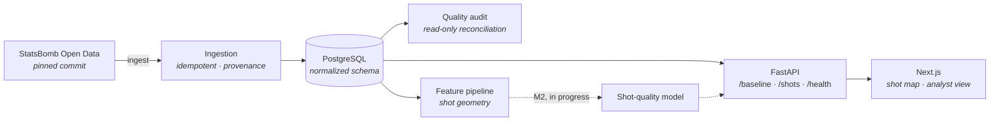

<div align="center">

# ⚽ Touchline Intelligence Platform

**A football research and decision-support platform built on open match data.**

From raw StatsBomb Open Data → a validated relational database → an API → an analyst interface,
with an evidence trail behind every number.

[**Live app**](https://touchline-intelligence.vercel.app) ·
[**API docs**](https://touchline-intelligence-production.up.railway.app/docs) ·
[Development guide](docs/DEVELOPMENT.md) ·
[Plan & roadmap](docs/PLAN.md)

`Python 3.12` · `FastAPI` · `PostgreSQL` · `Next.js 16` · `TypeScript` · `Docker`

</div>


---

## What this is

Football generates enormous amounts of event data, and most of it never becomes a decision. This
project takes four major international tournaments' worth of open match events and turns them into
something an analyst can actually use: a queryable database with known provenance, a set of
measured, reproducible analyses, an API, and a web interface that shows what happened on the pitch.

The long-term goal is a **calibrated shot-quality model** — an expected-goals-style estimate that is
honest about its own uncertainty. The route there is deliberately slow: data first, evidence second,
model third. Nothing is presented as a result until it has actually been evaluated.

> **Where it stands today**
> The data foundation is complete and deployed. The shot-quality model is **not built yet** —
> the numbers you see in the app describe *recorded outcomes*, not predictions. That distinction is
> enforced throughout the codebase, not just mentioned in a footnote.

## What it does

| | Feature |
|---|---|
| 🗄️ | **Validated relational database** — 843k events, 5.8k shots, 230 matches across four tournaments, in a normalized, constraint-enforced PostgreSQL schema managed by ordered hand-written migrations |
| 🔒 | **Provenance you can verify** — the source is pinned to an exact commit, every file read is SHA-256 fingerprinted, and the manifest is committed so another machine can prove it got identical bytes |
| ♻️ | **Idempotent ingestion** — reruns are no-ops; a source fact that changed under the same pinned commit raises an error instead of silently rewriting history |
| 🔍 | **Independent data-quality audit** — a read-only reconciliation pass that re-counts every grain against the source and reports missingness, invariant violations, and known limitations |
| 📊 | **SQL analysis pack** — ten documented, read-only analytical queries with measured query plans |
| 🌐 | **REST API** — descriptive baseline, paginated read-only shot queries, liveness and readiness endpoints |
| 🗺️ | **Interactive shot map** — every recorded shot at its recorded location, encoded so it can't be mistaken for a model output |
| 📐 | **Shot geometry features** — distance to goal centre and visible goal angle, computed in a numerically stable form over the locked model cohort |
| ✅ | **Tests that are themselves tested** — a mutation script breaks each protected behaviour on purpose and confirms the suite catches it |

## Architecture

A small, deliberately boring stack: one repository, one API, one database, one frontend.



| Layer | Choice | Why |
|---|---|---|
| Data | StatsBomb Open Data, pinned to a commit SHA | Free, high quality, and reproducible only if the revision is fixed |
| Storage | PostgreSQL + ordered SQL migrations | Real relational modelling, real constraints, no ORM magic hiding the schema |
| Backend | Python 3.12, FastAPI, psycopg | Typed settings, strict mypy, small dependency surface |
| Frontend | Next.js 16, React 19, TypeScript | Server-rendered analyst views with type safety end to end |
| Infra | Docker Compose locally · Vercel + Railway + Neon in production | Cheap, reproducible, and deployable by one person |
| Quality | ruff, mypy (strict), pytest, Vitest, GitHub Actions | One `uv run poe check` runs what CI runs |

## The data

Four international tournaments, ingested in full:

| Tournament | Matches | Events | Shots |
|---|---:|---:|---:|
| FIFA World Cup 2018 | 64 | 227,825 | 1,706 |
| UEFA Euro 2020 | 51 | 192,664 | 1,289 |
| FIFA World Cup 2022 | 64 | 234,637 | 1,494 |
| UEFA Euro 2024 | 51 | 187,924 | 1,340 |
| **Total** | **230** | **843,050** | **5,829** |

Plus 54 teams, 1,989 players, 11,062 lineup memberships, 39,262 possessions, 1.23M directed event
relations, and 78,866 actors from shot-embedded freeze frames.

The **public API is intentionally limited to World Cup 2022** while an open question about
row-level data redistribution is resolved with the data provider — see
[`DATA_SOURCE.md`](DATA_SOURCE.md).

Two things this project deliberately does **not** do:

- **It never ingests the provider's own xG values.** They are the strongest leakage risk for a
  shot-quality model, so they are stripped before storage and blocked by a database constraint.
- **It never calls shot freeze frames "tracking data".** A freeze frame is a partial snapshot around
  one event. Continuous player tracking is a different product, and this project does not have it.

## Quick start

You need [uv](https://docs.astral.sh/uv/), Node.js 24, and Docker Desktop.

```bash
git clone https://github.com/utkuvibing/touchline-intelligence.git
```

```bash
cd touchline-intelligence
```

```bash
cp .env.example .env
uv sync
npm --prefix frontend ci
```

```bash
docker compose -f infra/docker-compose.yml up -d
```

```bash
uv run poe migrate
uv run poe ingest
```

`ingest` downloads the pinned 465-file StatsBomb snapshot on first run, so give it a few minutes;
reruns are no-ops.

```bash
uv run poe api
```

The API is then on `http://localhost:8000` (docs at `/docs`), and `npm --prefix frontend run dev`
serves the interface on `http://localhost:3000`.

Full command matrix, testing contract, ingestion internals, and endpoint semantics live in the
[**development guide**](docs/DEVELOPMENT.md).

## Repository layout

```text
backend/src/touchline/   FastAPI app, config, ingestion, quality audit, features
backend/sql/             Hand-written analytical and verification queries
backend/tests/           pytest — unit, integration, data-quality, reproducibility
frontend/                Next.js + TypeScript + Vitest
infra/                   Docker Compose for local PostgreSQL
data/provenance/         Committed source manifests (commit SHA + per-file hashes)
docs/                    Plan, schema, ADRs, research, experiment records, releases
scripts/                 Documented developer entry points
reports/                 Generated quality and evidence reports
```

## Roadmap

| Milestone | Ships | State |
|---|---|---|
| **M0** Walking skeleton | End-to-end path: data → PostgreSQL → API → UI → deployment | ✅ Complete |
| **M1** Data foundation | Relational schema, idempotent ingestion, quality audit, SQL pack, reproducible clean rebuild | ✅ Complete |
| **M2** Shot quality engine | Model cohort, geometry and context features, leak-free splits, logistic regression → gradient boosting → PyTorch MLP, calibration and error analysis | 🚧 In progress |
| **M3** Analyst interface & serving | Prediction API with model versioning, full analyst UI with calibration views, deployment hardening | ⬜ Planned |
| **M4** Release & communication | Technical write-up, stakeholder summary, model card, demo | ⬜ Planned |

Detail, acceptance criteria, and the reasoning behind each scope decision are in
[`docs/PLAN.md`](docs/PLAN.md).

## How this project works

A few working rules that shape everything in here — they are the reason some obvious features are
missing and some documentation is not optional:

- **No unevaluated number is presented as a result.** The API's conversion rate says in its own
  payload that it is a description of loaded data, not a prediction.
- **The shot map encodes recorded outcomes only** — uniform marker size, no colour ramp. Both are
  how expected-goals maps draw a *model output*, and there is no model yet.
- **Tests protect named contracts, not coverage percentages.** A mutation script has already caught
  three tests that passed for the wrong reason.
- **Decisions that are expensive to reverse become ADRs**, with the evidence and the trigger that
  would reopen them.

## Documentation

| Document | What it covers |
|---|---|
| [`docs/DEVELOPMENT.md`](docs/DEVELOPMENT.md) | Commands, testing contract, ingestion internals, endpoint semantics, known gaps |
| [`docs/PLAN.md`](docs/PLAN.md) | Milestones, data scope, validation design |
| [`DATA_SOURCE.md`](DATA_SOURCE.md) | Source revision, terms review, coverage inventory, data dictionary |
| [`docs/SCHEMA.md`](docs/SCHEMA.md) | ERD, table grain, migrations, constraints |
| [`CONTEXT.md`](CONTEXT.md) | Canonical domain language |
| [`docs/adr/`](docs/adr/) | Architecture decision records |
| [`docs/DEPLOYMENT.md`](docs/DEPLOYMENT.md) | Vercel + Railway + Neon setup, environment variables, smoke test |
| [`docs/experiments/README.md`](docs/experiments/README.md) | Experiment record format and comparison rules |
| [`AGENTS.md`](AGENTS.md) | Working agreement for AI agents contributing to this repo |

## Credits & attribution

### Data provided by StatsBomb

<a href="https://github.com/statsbomb/open-data"><b>StatsBomb Open Data</b></a> — this project would
not exist without it.

StatsBomb (now part of [Hudl](https://www.hudl.com/)) collects and freely publishes detailed
event-level data for major competitions, including full World Cup and European Championship
coverage. Making data of that quality open is genuinely rare, and it is what allows an independent
project like this one to do real analytical work rather than toy examples.

- Repository: <https://github.com/statsbomb/open-data>
- Pinned revision used here: `b0bc9f22dd77c206ddedc1d742893b3bbe64baec` (2026-05-26)
- Terms and README reviewed on **2026-08-01** — see
  [`DATA_SOURCE.md`](DATA_SOURCE.md) for the dated record

**Please respect the source terms.** StatsBomb Open Data is provided under its own Public Data User
Agreement, which requires attribution — and, for published analysis, use of the StatsBomb logo. If
you build on this repository, credit StatsBomb, read their agreement yourself, and do not
redistribute the data.

Two open questions are tracked rather than assumed to be cleared: the official Media Pack did not
expose a clearly approved downloadable logo asset, and whether a public row-level API counts as
permitted analysis or prohibited redistribution is not yet resolved. Both are recorded as release
gates in [`DATA_SOURCE.md`](DATA_SOURCE.md), and public row-level coverage stays limited to World
Cup 2022 until they are.

This project **does not reproduce StatsBomb's proprietary xG model** and makes no claim to. Any model
built here is an independent estimate from open data.

### Built with

[FastAPI](https://fastapi.tiangolo.com/) · [PostgreSQL](https://www.postgresql.org/) ·
[Next.js](https://nextjs.org/) · [uv](https://docs.astral.sh/uv/) ·
[Ruff](https://docs.astral.sh/ruff/) · [poethepoet](https://poethepoet.natn.io/) ·
[pytest](https://pytest.org/) · [Vitest](https://vitest.dev/) — hosted on
[Vercel](https://vercel.com/), [Railway](https://railway.com/) and [Neon](https://neon.com/).

### Author

Built by **Utku Şahin** as an end-to-end portfolio project in football analytics and applied
machine learning. Questions, corrections, and pointed criticism are all welcome — open an issue or
get in touch:

[](https://www.linkedin.com/in/utku-%C5%9Fahin-696397210/)

## Licence

**Source-available, not open source.** The code is public so it can be read and evaluated; it is not
licensed for reuse. See [`LICENSE`](LICENSE) for what that allows and what it doesn't — and just ask
if you want to use a piece of it.

The match data is a separate matter entirely: it belongs to StatsBomb / Hudl and is governed only by
their own agreement. Nothing here grants any right to it.
