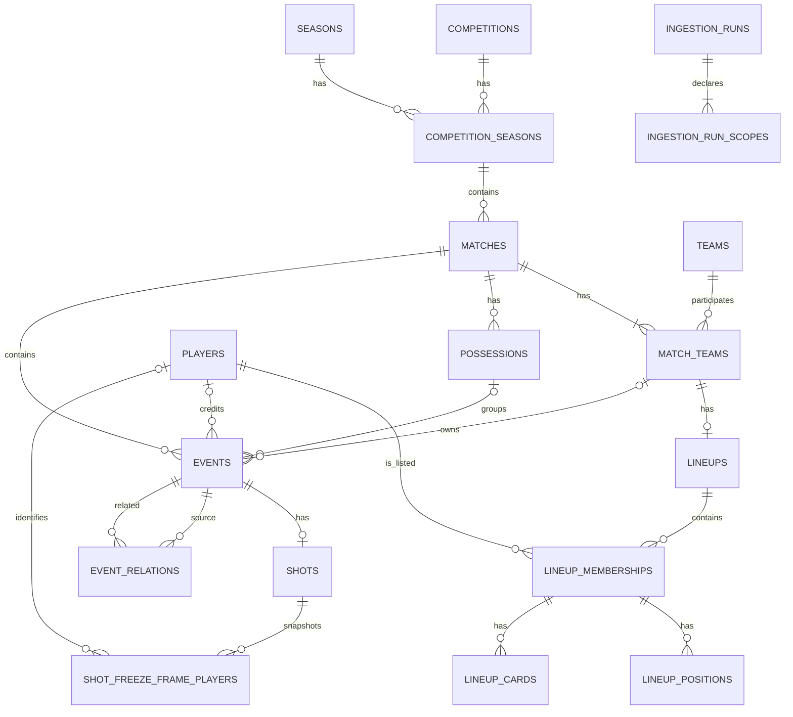

# Relational schema

This is the physical schema contract through WP1.3. It retains the relational event and lineup
scope accepted in [ADR 0009](adr/0009-full-relational-event-and-lineup-scope.md), then adds the
durable ingestion lifecycle accepted in [ADR 0010](adr/0010-idempotent-ingestion-and-manifest-lifecycle.md).
ADR 0009 supersedes the earlier shot-only boundary in ADR 0008.

## Entity-relationship diagram

`event_relations` is directed: source-to-related is stored as supplied, not mirrored. A Shot
freeze frame is an embedded event snapshot, not StatsBomb 360 or continuous tracking data.

## Table grain and identity

| Table | Grain and key |
|---|---|
| `competitions` | One source competition; `competition_id` PK. |
| `seasons` | One source season; `season_id` PK. |
| `competition_seasons` | One competition-season; `(competition_id, season_id)` PK. |
| `teams` / `players` | One source team/player; source integer PK. |
| `matches` | One source match; `match_id` PK. |
| `match_teams` | One recorded participant in a match; `(match_id, team_id)` PK, with each role unique within a match. |
| `lineups` | One submitted lineup for a match-team; `(match_id, team_id)` PK. |
| `lineup_memberships` | One source player listed in a match-team lineup; `(match_id, team_id, player_id)` PK. This is not an appearance. |
| `lineup_positions` / `lineup_cards` | One source position interval/card record; identity primary key plus 1-based `source_order` unique within its membership. |
| `possessions` | One source possession within a match; `(match_id, possession_id)` PK. |
| `events` | One source event; source UUID `event_id` PK. `(match_id, event_index)` is unique when the 1-based event index is present. |
| `event_relations` | One directed source-event to related-event link; `(source_event_id, related_event_id)` PK and 1-based order unique per source event. |
| `shots` | The 1:1 typed Shot detail for a Shot event; `event_id` PK. A constant `event_type_name = 'Shot'` discriminator participates in the event FK. |
| `shot_freeze_frame_players` | One embedded player observation in a typed Shot detail; identity PK and 1-based `source_order` unique within event. |
| `ingestion_runs` | One durable ingestion invocation; UUID `run_id` PK and unique owner token. Status, phase, source commit, ownership, sanitized error details, attempted counts, and per-table results are recorded. |
| `ingestion_run_scopes` | One declared competition-season per run; `(run_id, competition_id, season_id)` PK. Its parent FK uses the default non-cascading action so scope evidence cannot disappear through an implicit run deletion. |

Display names are labels, not identities. Source integers are retained for competition, season,
team, player, match, possession and category identifiers; source event IDs are UUIDs.

## Relational and JSONB boundary

Shared event facts are typed columns: match, team, optional player and possession, event order,
clock, location, event type, play pattern, position, duration, and the sparse booleans
`under_pressure`, `off_camera`, `out`, and `counterpress`. Shot-specific facts are relational in
`shots`, including outcome/body-part/technique/type IDs and names, end location, key-pass event,
and recorded sparse booleans.

`events.type_data` is the only residual JSONB column. It is nullable, must be a JSON object, is
for non-Shot type-specific data (including tactics), and must be NULL for Shot events. A recursive
JSONPath check rejects `statsbomb_xg` at any depth. Provider xG is never stored. This is a storage
boundary, not merely a feature-selection convention.

## Major database guarantees

- Match competition-seasons, match participants, lineups, possessions, and events have foreign
  keys to their recorded parents. Event and possession teams reference `(match_id, team_id)`, so a
  team cannot be attached to a match it did not participate in.
- Related event endpoints must be in the same match. Links are non-self and ordered but are not
  required to be symmetric.
- A shot detail can reference only an event whose type is `Shot`; freeze-frame actors reference the
  typed shot detail rather than an arbitrary event.
- Entity IDs with measured positive semantics are checked directly or through foreign keys; sparse
  category IDs remain opaque provider values (`position.id = 0` is a measured `Substitute` value).
  Names required by the source shape cannot be blank; scores are nonnegative and supplied as a
  complete pair.
- Event indexes and all source-order fields are positive when present. Event period, minute,
  second, duration and coordinates have the documented range/pair checks. `events.location_x`
  accepts raw measured source values from 0 through 120.1 inclusive; this is an observed-source
  boundary, not a redefinition of the nominal 120-by-80 scale. Position and freeze-frame
  location/name pairs are checked.
- A lineup position does **not** require `to >= from`: 17 measured source rows violate that
  assumption. Membership is not forced to have a position interval.
- Shot end coordinates are paired and bounded; key-pass event IDs and freeze-frame players refer
  to existing events/players when present.

Foreign keys use PostgreSQL's default `NO ACTION`; evidence rows are never cascade-deleted. No
secondary performance indexes are added in WP1.2. PostgreSQL may create indexes that back primary
keys and required uniqueness constraints, including the event ID/type subtype key; those are
integrity structures, not speculative query tuning. WP1.5 must use representative `EXPLAIN`
evidence before accepting any performance index write and storage cost.

## Ordered migrations

Migrations live in
[`backend/src/touchline/ingest/migrations/`](../backend/src/touchline/ingest/migrations/):

1. `0001_initial.sql` reproduces the unversioned M0 five-table schema.
2. `0002_relational_constraints.sql` adds its original foreign keys and source-shape checks.
3. `0003_normalize_competition_seasons.sql` splits the former composite competition table into
   competitions, seasons and competition-seasons, and backfills match participants.
4. `0004_event_and_lineup_core.sql` creates the relational event/lineup core and copies legacy
   shot shared fields into skeletal Shot events.
5. `0005_event_and_lineup_constraints.sql` adds the final relationships and checks, and makes
   `shots` the 1:1 typed detail by removing its duplicated shared event columns.
6. `0006_ingestion_runs.sql` adds durable invocation and declared-scope manifests with lifecycle,
   ownership, source-version, error and structured accounting checks.
7. `0007_measured_event_x_boundary.sql` replaces only the event x check with the inclusive
   measured-source range `0.0–120.1`; the 0005 migration and every other coordinate bound remain
   unchanged.

Run pending migrations with `uv run poe migrate`. `schema_migrations` records ordered versions,
canonical UTF-8/LF SHA-256 checksums and application time. The runner takes a transaction advisory
lock and locks the ledger, permits only an exact applied prefix, rejects gaps/unknown versions or
checksum drift, and makes a rerun a no-op. There are no down migrations.

An unversioned database can be adopted only when it exactly matches the known M0 table, type,
nullability and primary-key shape; a partial or drifted lookalike is rejected before ledger
adoption. Applying to an empty schema creates the full ordered shape. An existing database already
recorded through `0002` upgrades forward through `0003`-`0007` without dropping legacy shot facts.
The populated committed WP1.2 schema through `0005` upgrades through `0006`-`0007` in place, and a
repeated migration run remains a no-op.

The legacy upgrade deliberately creates only skeletal Shot events: it copies known match, team,
player, clock and location fields and leaves unknown event index, timestamp, possession, play pattern,
position, duration and all generic-event/lineup facts NULL or absent. Full source ingestion is
required to populate generic events and lineups; migration does not invent them.

## Measured event-coordinate exception

The pinned cohort contains exactly one event with `location_x = 120.1`: Euro 2024 (`55/282`),
Romania–Ukraine, match `3938638`, event `78116cc8-afbe-4bae-975b-57ce6983d045`. The raw value is
stored unchanged. Values below 0 or above 120.1 are rejected; NULL/pair semantics and the y,
shot-end and embedded freeze-frame bounds are unchanged. Any later modelling normalization or
geometry-safe representation must be a derived feature distinct from this raw source column.

## Scope boundaries

WP1.3 owns the fixed four-tournament ingestion, reject-on-change idempotency policy and durable run
manifest. Temporary staging tables use transaction-local key indexes only; no durable secondary
performance index is added. The live Neon database is not migrated automatically. Migration on
application boot remains out of scope. The public `/baseline` and `/shots` queries remain explicitly
WC 2022-only. Coverage thresholds beyond exact source/final reconciliation remain WP1.4 work.
