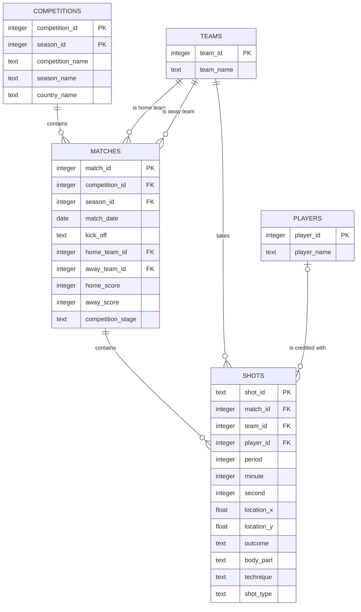

# Relational schema

This document is the WP1.2 schema contract: table grain, cardinality, ordered migration lifecycle,
and the boundary between database constraints and later pipeline validation. The current schema is
shot-focused by decision; see [ADR 0008](adr/0008-shot-focused-relational-boundary.md).

## Entity-relationship diagram



The relationship from `players` is optional on the shot side: unattributed shots remain rows with a
NULL `player_id`. The two team relationships on `matches` have distinct roles and are both required.

## Grain and keys

| Table | Grain | Source identity / uniqueness |
|---|---|---|
| `competitions` | One competition-season | Composite primary key `(competition_id, season_id)` |
| `teams` | One source team identity | Primary key `team_id` |
| `players` | One player credited with a stored shot | Primary key `player_id` |
| `matches` | One source match | Primary key `match_id` |
| `shots` | One recorded Shot event | Primary key `shot_id` |

The source identifiers are the natural keys, so their primary-key constraints are also the required
uniqueness guarantees. Display names are deliberately not unique: names are labels, can change, and
are not safe identity. A join from a competition-season to matches or from a match to shots is
one-to-many and therefore multiplies the parent row; aggregations must group at their stated grain.

## Ordered migrations

Migration SQL is packaged under
[`backend/src/touchline/ingest/migrations/`](../backend/src/touchline/ingest/migrations/):

1. `0001_initial.sql` reproduces the five-table M0 shape without dropping data. Its
   `CREATE TABLE IF NOT EXISTS` statements let an existing unversioned M0 database adopt the
   migration history only after the runner verifies the exact known tables, columns, PostgreSQL
   types, nullability, and primary-key columns. A partial or drifted lookalike is rejected.
2. `0002_relational_constraints.sql` adds the WP1.2 foreign keys and checks.

Run pending migrations with:

```bash
uv run poe migrate
```

`schema_migrations` records the ordered version, SHA-256 of the SQL canonicalised to UTF-8/LF, and
application time. Line-ending differences across Windows and Linux therefore do not create false
drift; a content change does. Re-running is a no-op. Applied versions must be an exact prefix of the
packaged sequence; gaps, unknown versions, missing files, and modified checksums raise instead of
backfilling or rewriting history. A schema-specific transaction advisory lock plus the ledger lock
prevent two migration processes from advancing the same schema concurrently. There are no down
migrations: production changes move forward with a new numbered file. For a disposable local rebuild,
`uv run poe ingest --reset` drops the managed tables and recreates them through the same migrations.

## Enforced constraints

| Area | Database guarantee |
|---|---|
| Relationships | Matches reference an existing competition-season and two existing teams; shots reference an existing match and team; optional shot players reference an existing player when present. |
| Identity | Source IDs are primary keys; duplicate competition-seasons, teams, players, matches, shots, and migration versions are rejected. |
| Match shape | IDs are positive; home and away teams differ; scores are nonnegative and either both known or both NULL. |
| Shot clock | Period is NULL or 1–5; minute is NULL or nonnegative; second is NULL or 0–59. |
| Location | Coordinates are either both NULL or both present; x is within 0–120 and y within 0–80. |
| Required labels | Competition, season, team, and player names and shot IDs cannot be blank. |

Foreign keys use PostgreSQL's default `NO ACTION` deletion behavior. Source entities are evidence,
not application-owned records to cascade-delete. Optional source values remain NULL; current WC 2022
completeness is not treated as a universal provider guarantee. Categories such as outcome, body
part, technique, and shot type remain open text because a closed list would turn a new source label
into a database outage.

## Deliberately outside database constraints

- Independent `shots.match_id` and `shots.team_id` foreign keys do not prove that the shooting team
  participated in that specific match. That cross-row football invariant belongs in the WP1.4
  quality suite unless a justified match-participant relation is introduced.
- A player foreign key proves identity exists, not lineup membership or match participation; the
  current `players` table is not a squad or appearance table.
- Category coverage, source/file reconciliation, expected match counts, and missingness thresholds
  depend on an ingestion scope and belong to pipeline quality checks.
- No secondary indexes are added in WP1.2. WP1.5 measures representative SQL with `EXPLAIN` before
  accepting the write and storage cost of an index.

## Current limitations

The schema stores shot events only. It has no generic event, lineup, appearance, possession,
related-event, 360, or continuous-tracking tables. Ingestion is still deliberately non-idempotent;
source-key upserts and the run manifest belong to WP1.3. Migration-on-application-boot remains M3.3.
