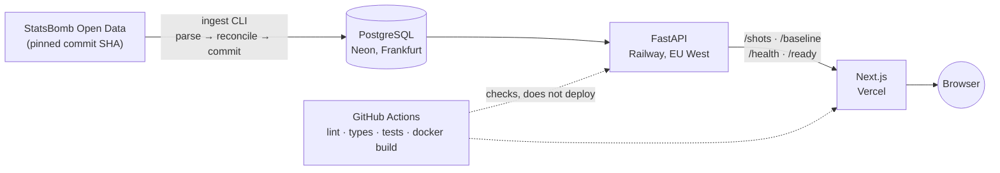

# Shipping a football data platform with no model in it — and three tests that were lying to me

> **Status: draft, not published.** Written 2026-08-01, immediately after the M0 milestone.
> Review before publishing anywhere.

**Live:** https://touchline-intelligence.vercel.app
**Repository:** https://github.com/utkuvibing/touchline-intelligence

---

## 1. What I set out to build

Touchline Intelligence turns [StatsBomb Open Data](https://github.com/statsbomb/open-data) into a
relational dataset, a calibrated shot-quality model, and an interface an analyst could use.

This article covers the first milestone, which contains **none of the model**. M0 had one goal: prove
a single narrow path end to end — source JSON → PostgreSQL → API → interface → public deployment —
with something trivially correct at every step and no claim I could not defend. Building an
impressive analytics demo is easy; saying which parts of it are trustworthy is not.

Development was AI-assisted. Framing each problem, deciding what to validate, and judging what
counted as finished stayed with me — which is where the interesting work turned out to be.

## 2. Architecture



One backend, one frontend, one database. No queue, no orchestrator, no warehouse. Every piece exists
because the product needed it, and I can say what breaks if you remove it.

## 3. Reproducible ingestion, and proving the load is right

The ingestion loads the 2022 World Cup: 64 matches, 32 teams, 431 players, 1,494 shots.

**The snapshot is pinned to a commit SHA, not `master`.** Open Data is live — the pinned commit is
titled "Added 1647 new games, updated 1213 games" — so loading from `master` would drift and every
measured count in my documentation would quietly stop being true. Each run writes a provenance record
with the commit and a SHA-256 per file, so another machine can prove it read identical bytes.

**Reconciliation happens inside the transaction, before the commit.** Write rows → read the counts
back → compare against the source files → commit only if they match. Nothing in the loader commits;
the caller owns the transaction.

**Missing optional data becomes NULL; malformed structure raises.** An unrecorded technique is a real
source condition. A location present but not *exactly* two numbers is not — StatsBomb uses
three-element coordinates elsewhere, for a shot's `end_location`, and silently taking the first two
would turn a misread field into a plausible coordinate: wrong, and invisible.

Counting the data also shaped the modelling cohort. **Every league season in StatsBomb Open Data is
single-team-centric** — Ligue 1 2021/22 is PSG in all 26 matches, Bundesliga 2023/24 is Leverkusen in
all 34, so a chronological holdout inside one measures a club's form curve rather than football drift.
The cohort will therefore be tournaments only, and the holdout will be called a *tournament* holdout,
because holding one out changes time and competition composition together.

## 4. What the deployed number is, and what it is not

The API serves a conversion rate: 152 goals from 1,430 non-penalty shots, 10.63%.

It is a **descriptive prevalence** — a summary of the loaded data. Not a model, not a prediction, and
not the baseline models will be compared against. The endpoint carries that distinction in its own
payload rather than leaving it to a README.

The comparison baseline is a different object with a different value: estimated from the **training
split alone**, then scored on validation and holdout rows under the same log loss, Brier score and
calibration protocol as every candidate. Using this full-cohort rate as a holdout prediction would be
leakage in its plainest form — it is computed from outcomes that include the holdout's own labels.

The interface follows the same rule: every marker is the same size and there is no colour scale.
Size-by-value and gradients are how expected-goals maps encode a model output, and either would imply
an estimate that does not exist. The only visual distinction is goal versus non-goal — a **recorded
outcome**, not an inference.

## 5. Three correctness failures I caught

**Reconciliation ran after the commit.** The loader committed, then compared counts and reported — so
a mismatch described data already kept. Moving transaction ownership to the caller turned
reconciliation from a report into a gate: counts are read inside the transaction, against rows
written but not yet durable, and a mismatch rolls the load back. A test now supplies a duplicate
player ID so the `players` COPY fails for real, then asserts a second connection sees nothing.

**A read-only test that tested nothing.** The shots query runs in a `READ ONLY` transaction. My test
called the query, then opened a *separate* transaction, ran `SET TRANSACTION READ ONLY` itself, and
asserted a write failed there — proving PostgreSQL honours the statement, which was never in doubt,
and passing happily with the production line deleted. It now installs a cursor factory that asks the
server `SHOW transaction_read_only` from inside the transaction the query established. Verified by
deleting that line: the test fails with `observed states: ['off', 'off']`.

**The map showed 500 of 1,494 shots while calling itself the tournament.** The API is deliberately
paginated; the frontend fetched one page and discarded the total. It now pages through until every
shot is retrieved, and says so explicitly if it ever falls short.

Two of those three passed a green test suite. Hence `scripts/verify_tests_fail.py`, which breaks each
protected behaviour once and asserts the tests notice — currently fourteen contracts. A green suite
proves the tests pass; it does not prove they would fail if the behaviour broke.

## 6. Deployment

Vercel (Next.js) → Railway (FastAPI in Docker, EU West) → Neon (PostgreSQL, Frankfurt).

The backend image is multi-stage and runs as non-root. `CMD` uses `sh -c` with `exec` so uvicorn
replaces the shell as PID 1 — without it a redeploy sends `SIGTERM` to the shell and uvicorn is killed
rather than shut down, dropping in-flight requests.

CORS is an explicit allow-list, never `*`; a configured wildcard is *dropped* rather than honoured, so
a stray asterisk fails closed. That exists because the test I wrote for it failed on first run.

GitHub Actions runs lint, type checks, tests against a PostgreSQL service container, and a Docker
build. It does **not** deploy: Railway and Vercel deploy from their own Git integrations, so no
platform token becomes a repository secret.

## 7. The deployment failure worth writing down

The first three Railway deploys failed their healthcheck. The app was crashing at import for want of a
database URL, and the log was sixty lines of pydantic traceback ending in
`db_url  Field required [input_value={}]`.

The diagnosis was in there — `input_value={}` means the container saw *no* variables — but nothing said
which variable to set. Pydantic reports the model's field (`db_url`); an operator at a deployment
console needs `TOUCHLINE_DB_URL`. I reproduced the failure locally in the same image and made the
error say what it means:

```
MissingConfigurationError: Missing required environment variable(s): TOUCHLINE_DB_URL.
Set them in the deployment platform's variables, or copy .env.example to .env for local
development. See docs/DEPLOYMENT.md.
```

Behaviour did not change — missing configuration still refuses to start, because an instance that boots
with no database and reports itself healthy is worse than one that will not boot. Only the message
improved, and that is what made the real cause legible: **Railway variables must be set on the
service, not the project.** The container cannot see project-level variables.

## 8. Verifying the deployment

`scripts/smoke_deployed.py` runs against the deployed URLs and passes 18/18, with every expected
number hard-coded — a smoke test that asks the system what it contains and then agrees with it has
checked nothing.

The most useful check: the served HTML must contain **exactly 1,495 `<circle>` elements** — 1,494
shots plus the pitch's penalty spot. An exact count is the difference between "the map drew something"
and "the map drew the tournament." The pagination bug above would have drawn 500 and sailed past any
"more than 100" assertion.

It also verifies that `/ready` genuinely reaches the database rather than merely being alive, and that
CORS allows the real frontend origin while refusing an unknown one.

## 9. Limitations, and what comes next

**There is no shot-quality model.** No performance claim on the site or in the repository has been
evaluated, because there is nothing yet to evaluate.

Also true today: one competition is loaded; the schema is provisional, with primary keys but no foreign
keys or migrations; ingestion is not idempotent; and `players` holds only players who took a shot, so
it is not a squad list.

M1 addresses the data foundation: the full four-tournament cohort (roughly 5,100 non-penalty shots), a
real schema with constraints and migrations, idempotent ingestion with a run manifest, and a
hand-written SQL analysis pack. The model comes after that, on a foundation whose numbers already
reconcile to source.

---

## Appendix: suggested screenshots

1. **The deployed shot map**, full pitch, with the caption stating no chance-quality estimate is
   encoded. The primary visual.
2. **`/baseline` JSON response** — `method: "descriptive-prevalence"` beside the counts and caveat,
   making section 4 concrete.
3. **`verify_tests_fail.py` output** — fourteen `[CAUGHT]` lines; the best illustration of section 5.
4. **Smoke test 18/18**, particularly the `1495 <circle> elements` line.
5. **Railway logs before and after** — the sixty-line traceback beside the one-line
   `MissingConfigurationError`.
6. **GitHub Actions run** — three green jobs including the Docker image build.

*Data provided by StatsBomb.*
