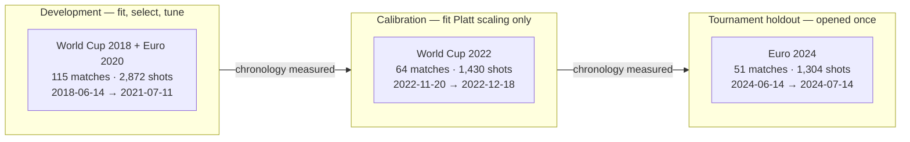
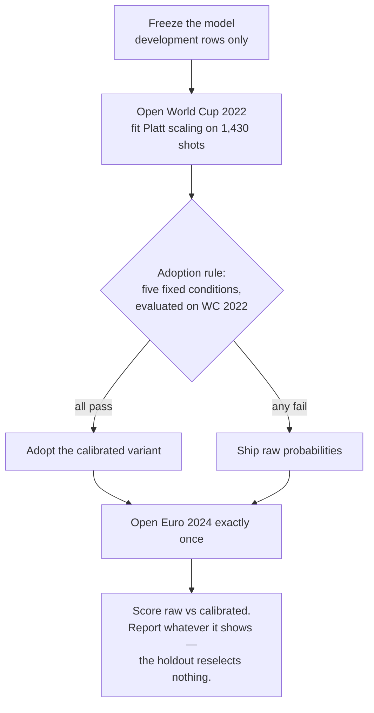

# A calibrated shot-quality model from open event data — and what its one holdout actually said

> **Status: published in the repository.** Written 2026-08-23, after the model (M2) and serving
> (M3) milestones closed; reviewed and linked from the README on 2026-08-25 as part of WP4.4.

**Live:** https://touchline-intelligence.vercel.app
**Repository:** https://github.com/utkuvibing/touchline-intelligence

---

## 1. The problem

Touchline Intelligence turns [StatsBomb Open Data](https://github.com/statsbomb/open-data) — free,
complete event data for a set of public competitions — into three things: a validated relational
dataset, a calibrated shot-quality model, and an analyst interface served on top of both.

A shot-quality model estimates, for each attempt, the probability that it becomes a goal given only
what was true at the moment the shot was taken: where it was struck from, with which body part, in
what kind of situation. It is the football analogue of a win-probability model, and the number most
people know by its commercial name, *expected goals*.

The obvious shortcut would have been to ingest the provider's own xG values and build an interface
around them. That shortcut is closed deliberately. First, it defeats the point: the purpose of this
project is to demonstrate that I can build and defend such a model, not to re-serve one. Second, and
more concretely, provider xG is the strongest leakage vector a project like this has — if the
answer you are trying to predict is sitting anywhere near your feature pipeline, everything you
report about your own model stops being trustworthy. So it never enters the database at all, and a
database constraint makes it impossible for it to become a model feature.

What ships today is a deployed system: a read-only shot map of recorded World Cup 2022 outcomes, a
descriptive prevalence endpoint that says plainly that it is a description and not a prediction, and
a model API serving the qualified artifact described below. Every number in this article traces to
an evidence report or experiment record committed in the repository; the paths are cited inline.

## 2. The cohort: four tournaments and nothing else

The source snapshot is pinned to one commit of StatsBomb Open Data (`b0bc9f22…`), not `master`.
Open Data is a live repository; loading from a moving branch would make every count in this article
quietly expire. Per-file hashes are stored alongside the load so another machine can prove it read
identical bytes.

The cohort design starts from a property of the open data that shaped cohort selection: **the
domestic league samples considered in this project's cohort-selection inventory are single-team-centric.**
Each has one club in all of its matches — Ligue 1 2021/22 and 2022/23 contain Paris Saint-Germain in
all 26 and 32 matches, Bundesliga 2023/24 is Bayer Leverkusen in all 34, and La Liga 2020/21 is
Barcelona in all 35. Those are not league seasons in any balanced sense — each is one club's season
plus its opponents. A validation split inside one of them measures a club's form curve, not anything
about football. (Full multi-team domestic seasons do exist elsewhere in the open set — England's
Women's Super League among them — but they sit outside this project's measured scope.) So the
modelling cohort uses complete, balanced international tournaments instead:

| Tournament | Eligible non-penalty shots | Goals | Regulation penalties | Shootout penalties |
|---|---:|---:|---:|---:|
| World Cup 2018 | 1,638 | 135 | 29 | 39 |
| Euro 2020 | 1,234 | 122 | 17 | 38 |
| World Cup 2022 | 1,430 | 152 | 23 | 41 |
| Euro 2024 | 1,304 | 98 | 12 | 24 |
| **Total** | **5,606** | **507** | **81** | **142** |

All 5,829 typed shots reconcile as these 5,606 eligible non-penalty shots plus 223 penalties.
Penalties are excluded because their conversion structure is dominated by the award context rather
 than shot quality; shootout kicks carry the `Penalty` type anyway, so the exclusion holds twice
over. Own goals sit outside the shot population entirely and were never coerced into it.

On missingness, stated precisely: **within this eligible cohort, every field the model requires —
player, period, the coordinate pair, outcome, body part, technique and shot type — has zero missing
values across all 5,606 rows.** That is a statement about those specific required fields over a
filtered cohort, not about the source dataset as a whole, where optional annotations are frequently
absent. Where an optional value is absent downstream, it stays absent: missing stays missing,
malformed structure raises.

One measurement shaped feature decisions later. Six candidate boolean annotations (`first_time`,
`under_pressure`, `one_on_one`, `open_goal`, `follows_dribble`, `aerial_won`) turned out to be
**true-only**: across 33,636 field-observations, not one records an explicit `false`. Absence of the
key therefore means *not annotated*, which cannot be separated from *annotated as not the case*.
Anything built on these fields is a presence indicator, not a boolean — a distinction that matters
when interpreting coefficients, and one that two of these fields failed a later test on. Their
true-rates also vary widely across tournaments (`under_pressure` 16.6% → 29.7%, `first_time`
21.8% → 32.7%), which is at least partly annotation intensity rather than football.

## 3. The split: three named parts, opened in order

Before any model existed, the 230 cohort matches were locked into three named parts:

Chronology between the top-level splits is strict and machine-checked: the last development match
(2021-07-11) precedes the first calibration match (2022-11-20), and the last calibration match
(2022-12-18) precedes the first holdout match (2024-06-14). Both inequalities are asserted by tests
that run against the full database ([evidence](../../reports/wp2.3-split-evidence.md)).

Inside development, cross-validation uses five folds of exactly 23 matches each (570 / 552 / 602 /
576 / 572 shots), produced deterministically by ordering matches exactly by `(match_date, match_id)`
and taking `index mod 5`.
These folds are **match-grouped, not temporal** — each fold spans the whole 2018–2021 window — and
that is deliberate. Shots from one match share teams, opponents, conditions and match context, and
they are statistically dependent: one match produces clusters of comparable chances shaped by the
same game state, tactics and playing conditions. Letting one match's shots appear on both sides of
a validation boundary risks optimistic validation scores — within-match dependence means a model
can score well there by leaning on shared context that the fold is supposed to withhold. The folds
are grouped by match so no match ever crosses one. Within-tournament time ordering carries little extra information here
anyway: a tournament lasts four weeks, so "earlier group-stage matches" is not a meaningful
training/testing boundary the way it can be across a league season.

Two honesty notes that belong in any write-up of this design. First, the reliability evaluation
uses **five equal-width probability bins fixed before any outcome was touched** — the bin count was
chosen from label-free scale alone (51 holdout matches, 1,304 shots), never tuned against results.
Second, the holdout is **locked but never blind**. Earlier descriptive work had already published
per-tournament goal counts including Euro 2024's, and aggregate conversion rates were viewed during
exploration before the split froze. That history is recorded in the repository rather than claimed
away; what "locked" buys is that Euro 2024 influenced no model, feature, calibration or selection
decision — it was scored once, after everything else was frozen.

## 4. Two features, measured carefully

The continuous features are the classical pair: distance from the goal centre, and the visible goal
angle subtended by the two posts. Both are computed from raw shot coordinates in a numerically
stable two-post form, and both were verified against the provider's pitch specification rather than
assumed. Three things the implementation got wrong until measurement said otherwise:

**The naive angle formula fails on real rows, not toy ones.** The common single-arctangent
shortcuts break inside a disc of radius 4 around the goal centre — returning a negative angle for a
shot that sees an obtuse slice of goal, or dividing by zero. That region is populated: 38 cohort
shots lie strictly inside it and one sits exactly on its boundary. At the pinned test case
(x=118, y=40), the naive form returns −0.9273 radians; the correct two-post form returns 2.2143.
Thirty-nine real shots motivated the stable formulation.

**One source coordinate needed a bounded tolerance adjustment.** Exactly one row in 5,606 records a
location fractionally behind the goal line: a corner-kick shot recorded at (120.1, 0.8) — the corner
arc, 0.1 units past the goal line the pitch nominally ends at. Left alone it produces a negative
visible angle and breaks the geometry invariant. The fix adjusts the *derived feature only*: that
row is treated as (120.0, 0.8), the source value stays untouched everywhere, and any future
coordinate beyond the measured source maximum raises an error instead of being silently clamped.
This is a documented exception with a reason, not a fudge factor.

**Attacking direction was established empirically, then left alone.** The specification documents
pitch coordinates but not direction of play. Measurement settled it: only 9 of 5,606 shots (0.16%)
sit below the halfway line, so coordinates already face the attacking goal and no transform is
applied — recorded as a deliberate no-op rather than a skipped step.

On top of geometry, the model uses categorical context: body part, technique, play pattern and shot
type, one-hot encoded with explicit rare-level handling (levels like `Other`, or techniques with a
few dozen occurrences, collapse to a rare bucket fitted on training data only). One consequence of
the tournament-based split deserved its own note: `Corner` exists as a shot type only six times in
the whole cohort, none of them before World Cup 2022 — so development never trains on it. The
encoder's unseen-level policy is therefore exercised by construction, not by luck.

Finally, the two best-known context annotations — `first_time` (a first-time finish) and
`under_pressure` — were tested and **left out**, by a rule fixed before the runs ran: a candidate
feature survives only if it improves log loss on at least four of the five development folds. These
two improved exactly three. As true-only presence indicators they also measure whether an annotator
chose to flag something, not whether a property held. Excluded means excluded; their fitted
coefficients are reported in the evidence only as diagnostics.

## 5. Choosing the model

Model replacement followed a rule written down before any experiment output existed: a challenger
replaces the incumbent only if it wins mean log loss beyond the incumbent's own cross-fold
variability, does not degrade Brier score, does not worsen supported-bin calibration, and is not
less stable across folds — all judged on development folds only, never on the holdout. Ties go to
the simpler model.

Six candidates, identical rows, identical folds, identical protocol:

| Candidate | Mean log loss | Cross-fold SD | Brier (pooled) | ROC AUC | PR AUC | Supported bins | Max abs deviation |
|---|---:|---:|---:|---:|---:|---:|---:|
| Constant (training-fold base rate) | 0.301886 | 0.017234 | 0.081509 | 0.476 | 0.085 | 1 | 0.000048 |
| Geometry-only logistic (C=0.1) | 0.269951 | 0.016579 | 0.074725 | 0.735 | 0.261 | 2 | 0.002906 |
| Full logistic incl. presence flags (C=0.1) | 0.262047 | 0.016550 | 0.072459 | 0.754 | 0.305 | 2 | 0.065201 |
| **Logistic without presence flags (shipped)** | **0.263358** | 0.016167 | **0.073044** | **0.753** | 0.294 | 2 | 0.053595 |
| Histogram gradient boosting | 0.268004 | 0.014544 | 0.074544 | 0.741 | 0.259 | 2 | 0.031439 |
| PyTorch MLP | 0.266694 | 0.016148 | 0.073870 | 0.749 | 0.282 | 2 | 0.032523 |

Log loss and Brier are proper scoring rules — they are minimised by the true probabilities, which
is why a calibrated-chance product is judged on them rather than accuracy (a model predicting
"non-goal" every time is ~91% accurate and useless). Log loss is the mean of the five folds' values;
Brier is pooled out-of-fold; "supported bins" counts reliability bins holding at least 100 pooled
predictions, and deviation is the worst predicted-versus-observed gap among those bins. Sources:
the baselines record ([WP2.4](../../reports/wp2.4-baselines-evidence.md)), the boosting comparison
([WP2.5](../../reports/wp2.5-gradient-boosting-evidence.md)) and the MLP qualification
(`experiments/shot_quality/exp-20260809-wp2_6-pytorch-mlp/`).

**The shipped model is the L2-regularized logistic regression without presence flags.** Dropping the
two presence flags cost almost nothing on primary metrics (log loss 0.2634 vs 0.2620 for the fuller
model) and removed a family of features whose meaning could not be defended. Its final refit on all
2,872 development rows reads plainly: a one-standard-deviation increase in distance multiplies the
odds of conversion by 0.55; a one-SD increase in visible angle multiplies them by 1.61; headers
convert at roughly 0.55× the odds of right-footed shots from equivalent situations; chances from
corners underperform regular play (odds ratio 0.58) while counters outperform it (1.31).
Regularization shrinks all magnitudes toward zero, so these are conservative descriptions, not
causal effects.

**Gradient boosting did not replace it.** On 2,872 rows with ~257 goals, the declared twelve-point
grid selected its most conservative corner (slowest learning rate, shallowest trees), and the
booster finished worse on both proper scores while winning calibration deviation (0.031 vs 0.054)
and fold-to-fold stability. Under a rule weighted toward proper scoring rules, two of four
conditions do not replace a model — so the incumbent stayed, and the comparison publishes as-is.
Stated differently: relative to knowing only the base rate, the booster recovers about 88% of the
logistic model's information gain per shot.

**The PyTorch MLP did not either** — mean log loss 0.2667 against 0.2634 — matching the
pre-registered expectation that a small network on ~2,900 tabular rows would fall slightly short of
regularized logistic regression. Losing was a publishable result by design; the artifact's value is
the fair comparison, not the architecture.

One honest wrinkle in the selection machinery deserves its own paragraph. Applied mechanically, the
replacement rule names the *constant* baseline as incumbent, because a constant predictor lands in a
single reliability bin where observed equals predicted by construction (deviation 0.000048) — no
real model can undercut that, so the calibration condition is unsatisfiable against it. This is a
degeneracy of applying a calibration clause to a baseline that outputs one number, and it was
investigated and recorded when it happened rather than tuned away. It is not a claim that the
constant is the better predictor: on every primary metric the shipped logistic dominates it (log
loss 0.263 vs 0.302). The distinction between "what the rule's bookkeeping labels incumbent" and
"what ships and why" is kept explicit in the records.

Reproducibility was treated as part of model choice, not paperwork. Two consecutive runs of the
training command produce byte-identical metrics, config and model artifacts — which required
pinning OpenMP thread count at process start (thread count changed serialized bytes while leaving
predictions bit-identical) and normalising line endings so a Windows checkout and a Linux checkout
hash the lockfile identically. Both defects were caught and root-caused during the work, not after
deployment.

## 6. Calibration, and what the holdout actually said

Calibration — whether a predicted 30% chance converts 30% of the time — is the property this use
case lives or dies on, more than ranking. The phase boundary was mechanical:

The base model was frozen on development data before World Cup 2022 was touched. Calibration is a
two-parameter Platt transform — a logistic rescaling of the model's log-odds, `sigmoid(slope × logit
+ intercept)` — fitted on the 64 World Cup 2022 matches only, with slope 1.2563 and intercept
0.7228. The slope above one mildly sharpens the model, pulling extreme predictions slightly further
from the middle; the intercept records the fitted offset applied on top of it. An adoption rule with
five fixed conditions decided, before the holdout, between shipping raw or calibrated probabilities.
Measured on World Cup 2022, calibration improved everything it promised: log loss 0.2875 → 0.2839,
Brier 0.0832 → 0.0820, worst supported-bin deviation 0.0122 → 0.0043, and all five conditions
passed. The calibrated variant was adopted.

**That adoption should be described as faithfully executed but methodologically weak**, for two
reasons visible in its own evidence. First, the Platt parameters were fitted on World Cup 2022 and
the adoption decision was evaluated on that same population — the rule measures improvement
in-sample on the very data the transform was fitted to, so some improvement is close to guaranteed
and its size says less than a clean table suggests. Second, of the five equal-width reliability
bins, only **one** cleared the pre-set support floor of 100 predictions on World Cup 2022 — nearly
all predictions sit below 0.2 — so the headline deviation improvement rests on a single bin. A
stronger design would fit the transform on one tournament and evaluate adoption on a different one;
this corpus had exactly one calibration tournament, so the weakness is structural, acknowledged in
the records, and carried forward rather than papered over.

Then Euro 2024 was opened — once, inside a single supervised execution with an ordered audit ledger
(opened → membership asserted → scored → bootstrapped → sliced → evidence written → closed), and a
recorded decision hash. The results, reported exactly as measured:

| Variant | Log loss | Brier | ROC AUC | PR AUC |
|---|---:|---:|---:|---:|
| Raw (uncalibrated) | **0.2393** | **0.0647** | 0.7447 | 0.2240 |
| Calibrated (adopted) | 0.2431 | 0.0660 | 0.7447 | 0.2240 |

Observed prevalence: 98 goals in 1,304 shots (7.52%). Discrimination is identical by construction —
Platt scaling is monotone, so it reorders nothing — and the calibrated variant scored slightly
*worse* on both proper scores. A paired bootstrap over matches (2,000 replicates, seed 0) puts the
calibrated-minus-raw log-loss difference at [+0.000095, +0.007816] — the interval excludes zero, so
on this tournament calibration reliably made log loss worse — while the Brier difference
[−0.000013, +0.002806] is indistinguishable from zero.

The adoption stands anyway, and the reasoning matters more than the outcome: the decision was taken
under a pre-registration that forbids the holdout from reselecting anything. Undoing a decision
because the holdout frowned at it would be exactly the post-hoc reversal the protocol exists to
prevent — and it would convert a one-time evaluation into a feedback loop. What the holdout bought
is knowledge: on a later, different-composition tournament, the calibration gain measured on World
Cup 2022 did not transfer to log loss. That sentence, with the numbers above, is part of the
permanent record.

## 7. Where the model is trustworthy: slices

Aggregate log loss hides as much as it shows, so the holdout packet reports performance across six
pre-declared slice families — body part, technique, play pattern, shot type, distance band,
visible-angle band — under a support floor fixed in advance (at least 50 shots, 5 goals, 5 misses
and 10 matches per level). Levels clearing the floor on Euro 2024: Head / Left Foot / Right Foot;
distance [0,10), [10,20), [20,30); Regular Play, From Corner, From Counter, From Free Kick,
From Throw In; Open Play; Half Volley / Normal / Volley; angle bands [0.2,0.4), [0.4,0.6),
[0.6,+∞) radians.
Everything else is listed as sparse and deliberately not interpreted — a two-goal slice average is
noise wearing a costume. Reliability and slice figures from the supervised run live with the
experiment packet (`experiments/shot_quality/exp-20260809-wp2_7-calibration-holdout/plots/`).

## 8. Limitations

Read together with the results, not after them.

1. **The holdout confounds time with competition composition.** Holding out Euro 2024 changes both
   simultaneously; the evaluation cannot separate "later" from "different tournament". It is named
   a tournament holdout throughout for that reason.
2. **Everything is pinned to one source revision.** Counts, splits and results describe this
   snapshot; nothing here generalises to other competitions, seasons or providers by construction.
3. **The calibration evidence is structurally thin.** Adoption was evaluated in-sample on the
   population the transform was fitted to, and only one reliability bin met the support floor there
   (Section 6). The holdout then showed the adopted calibration worsening log loss. Both variants
   are recorded side by side in the holdout evidence, so nothing about that comparison is hidden.
4. **Reliability mass concentrates below 0.2.** With few supported bins for every candidate,
   calibration comparisons rest on narrow bases throughout M2.
5. **Annotation intensity varies across tournaments** (`under_pressure` 16.6%→29.7%, `first_time`
   21.8%→32.7%), so those labels partly measure annotator behaviour; the tournament-based split is
   accordingly partly confounded with annotation regime. This measured concern contributed to
   excluding both fields from the shipped feature set.
6. **Development never saw the `Corner` shot type** (6 rows, none before 2022). Unseen levels map
   to the rare bucket by policy, but the policy's behaviour on this level is untested against real
   outcomes in development folds.
7. **The holdout was locked, not blind**, and exploratory descriptive viewing preceded the freeze;
   the history is disclosed in the split contract rather than claimed away.
8. **This is not StatsBomb's xG.** Different data scope, different features, different method, and
   no claim of equivalence is made or implied.
9. **Historical row-level model predictions remain gated.** The public descriptive shot map of
   recorded World Cup 2022 outcomes is unchanged and stays available; what remains closed pending
   clarity on the source terms is publishing historical row-level *model predictions* (`/model/shots`).
   The deployed interface respects that gate today.
10. **Aggregate evidence supports no row-level or causal claims.** Nothing here says why a specific
    shot missed, whether a player should have scored, or what a team should do differently.

## 9. What ships

The qualified release (`exp-20260810-wp2_8-release`) is the development-fitted logistic without
presence flags plus the World-Cup-2022 Platt transform, content-hashed and reproduced
byte-identically in its registered environment before qualification. It is served by a FastAPI
backend with versioned metadata, metrics and prediction endpoints, golden-parity-tested against the
offline artifact, behind a Next.js analyst interface — all deployed, smoke-tested against
production, with documented rollback paths. The model endpoints expose versioned provenance, and
the readiness endpoint reports which model version is loaded; the interface shows sample sizes,
limitations and attribution on the page itself.

Every number in this article comes from the repository's committed evidence:
[`reports/`](../../reports) holds the per-work-package reconciliation, evidence and closeout
documents; `experiments/shot_quality/` holds the immutable experiment packets. Where display rounds
twelve-decimal stored values, the underlying bytes are the authority.

Data provided by [StatsBomb](https://statsbomb.com). Open Data terms reviewed and dated in the
repository before ingestion and before this draft.
